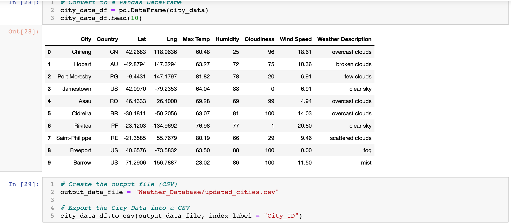
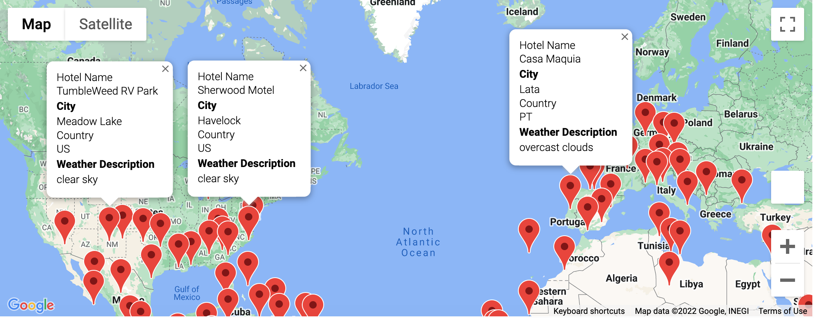
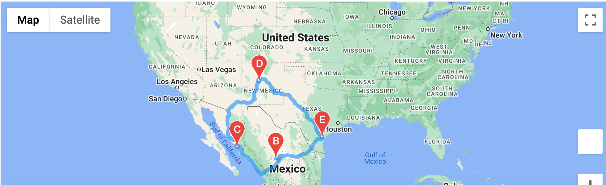

# World_Weather_Analysis

# Overview
The overview for this project was to provide three different deliverables completing the three tasks set for me.
For Delverable 1, I wask tasked in retireving weather data on 2,000 different latitudes and longitudes using API calls with OpenWeatherMap. 

# Results
## Deliverable 1
When retrieving this data, I also got information on the citiies that resides in the latttuides and longitudes I gathered such as its name, max temperature and weather description. I then created a new DataFrame for all cities gathered.

### Updated Cities DataFrame

## Deliverable 2
Deliverable 2, with the help of Google Cloud Platform, I identified potential travel destinations and potential hotels for travelers. I then placed the hotels as markers around the globe in order to give travelers options no matter where they are. 

### World Map

## Deliverable 3
For the final Deliverable, I used the Google directions API to create a travel itinerary showing a route between four cities from a customer's travel destinations. I then created a marker map with pop-ups that labels each city's name and info on the itinerary.

### Driving Map

### Hotel Map

# Resources

