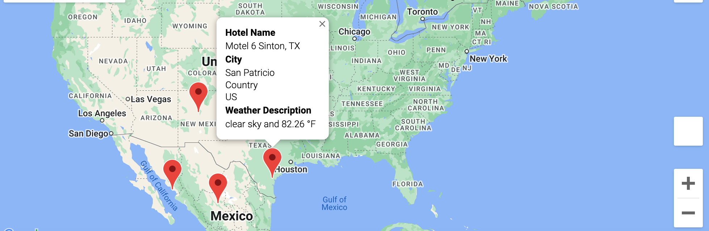

# World_Weather_Analysis

# Overview
The overview for this project was to make a few changes based on the previous work I've done. Using OpenWeatherMap, I first was tasked with adding weather description to my indexes in the upcoming DataFrame. This would be used to provide potential travel destinations for beta testers. Then, using Google Maps API, I had to create maps and routes for travelers based on where they decided to go.

# Results
## Deliverable 1
For Deliverable 1, I was tasked in retrieving weather data on 2,000 different latitudes and longitudes using API calls with OpenWeatherMap. When retrieving this data, I also got information on the cities that resides in the latitudes and longitudes I gathered such as its name, max temperature and weather description. I then created a new DataFrame for all cities gathered.

### Updated Cities DataFrame

## Deliverable 2
Deliverable 2, with the help of Google Cloud Platform, I identified potential travel destinations and potential hotels for travelers. I then placed the hotels as markers around the globe in order to give travelers options no matter where they are. 

### World Map

## Deliverable 3
For the final Deliverable, I used the Google directions API to create a travel itinerary showing a route between four cities from a customer's travel destinations. I then created a marker map with pop-ups that labels each city's name and info on the itinerary.

### Driving Map

### Hotel Map

# Resources
- Anaconda version 2.1.1
- Jupyter Notebook version 6.4.5
- Python version 3.9.7
- Pandas version 1.3.4
- OpenWeatherMap
- Google Cloud Platform

